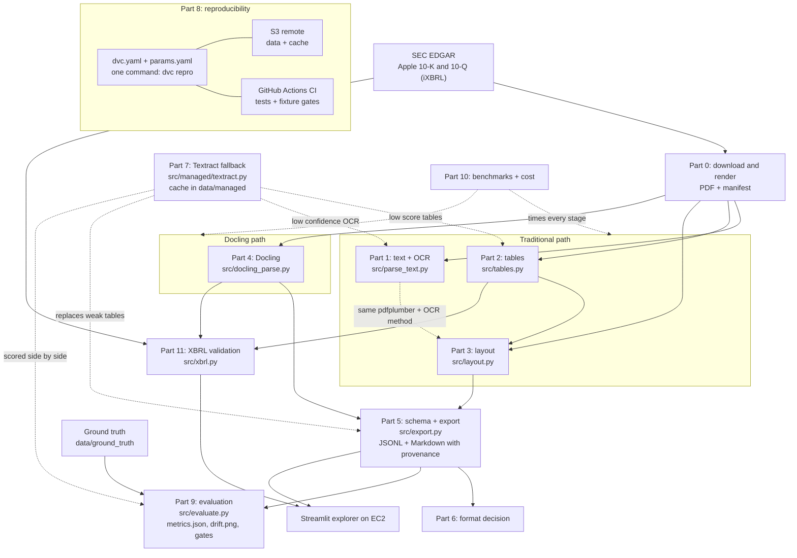

# Project LANTERN: Team 2

LANTERN turns SEC filings into a searchable-by-provenance financial corpus: page text, word boxes, normalized tables, layout blocks, figure crops, Markdown, and JSONL records tied back to their source. This is Case Study 1 for DAMG 7245 (Fall 2026). It compares a traditional PDF/OCR pipeline with Docling, evaluates extraction against transcribed ground truth, and checks statement values against Arelle XBRL facts. Embeddings, retrieval, and question answering are outside this case study's scope.

The inputs are pinned in [params.yaml](params.yaml): Apple 10-K accession `0000320193-25-000079` (period `20250927`) and 10-Q accession `0000320193-26-000020` (period `20260627`). The recorded rendered corpus has 61 and 30 pages respectively; scanned, statement, and multi-column fixtures exercise cases not covered by ordinary filing prose. See [test fixtures](tests/fixtures) and [benchmark evidence](reports/benchmarks.md).

## Submission and review links

| Deliverable | Location / status |
|---|---|
| Source repository | [Team repository](https://github.com/BigDataIA-Fall-26-Team-2/DAMG-7245-Project-Lantern-Team-2) |
| Reports and measured results | [Part-to-file map](#part-to-file-map) below |
| Codelab | [Project LANTERN Codelab](https://bigdataia-fall-26-team-2.github.io/DAMG-7245-Project-Lantern-Team-2/lantern-case-study-1/) (source: [docs/codelab.md](docs/codelab.md), exported with claat) |
| Demo video | Recording/publication pending — [#76](https://github.com/BigDataIA-Fall-26-Team-2/DAMG-7245-Project-Lantern-Team-2/issues/76), [#79](https://github.com/BigDataIA-Fall-26-Team-2/DAMG-7245-Project-Lantern-Team-2/issues/79) |
| Public Streamlit app | [LANTERN explorer](http://184.196.23.157:8501) — available while the team EC2 instance is running; [operations](#ec2-deployment-and-operations) |
| Final `submission` tag | Pending final fresh-cache verification and release — [#78](https://github.com/BigDataIA-Fall-26-Team-2/DAMG-7245-Project-Lantern-Team-2/issues/78) |
| Codelab | [LANTERN Codelab](https://codelabs-preview.appspot.com/?file_id=1UfLZZwyC2D44Uf5YMita2s0hHpX88bJcP-SLJkTxXvw) |
| Demo video | Pending |
| Public Streamlit app | [LANTERN explorer](http://184.196.23.157:8501), available while the team EC2 instance is running; [operations](#ec2-deployment-and-operations) |
| Final `submission` tag | Pending |

**Integration status:** the ten-stage EC2 reproduction completed, followed by the corrected CPU benchmark run. The recorded EC2 validation passed 183 tests; DVC reported the pipeline up to date and the S3 cache in sync after upload. The managed cache is uploaded and the refreshed lockfile and evaluation artifacts are committed. See the [EC2 validation log](docs/ai_log/lokesh.md) and [metrics](reports/metrics.json). The final check, a fresh clone of the `submission` tag on EC2 running the reproduction contract, is done after tagging.

## Architecture

Each box is one Part of the case study. Solid arrows are data flow, dotted arrows are optional or measuring steps. [dvc.yaml](dvc.yaml) is the authority for exact file dependencies.



Part 1 also writes standalone page-text and word-box artifacts; the layout stage uses the same pdfplumber and OCR method for its text blocks, and the export stage reads layout, table, and Docling outputs.

Git versions code, parameters, reports, fixtures, and DVC pointers. DVC versions generated datasets and stores their cache in private S3. Managed OCR is cache-first; `managed.enabled: false` prevents new Textract calls but does not make the private S3 remote anonymous.

## Repository structure

```text
.
├── README.md, CONTRIBUTING.md, WORKPLAN.md, SKILLS.md
├── requirements.txt, requirements-ci.txt, params.yaml
├── dvc.yaml, dvc.lock, .dvc/config
├── .github/workflows/smoke.yml
├── src/
│   ├── download.py, render.py, contracts.py
│   ├── parse_text.py, tables.py, layout.py, docling_parse.py
│   ├── schema.py, adapters.py, export.py, export_txt.py
│   ├── managed/textract.py
│   └── xbrl.py, evaluate.py, bench.py
├── app/app.py
├── config/label_map.yaml
├── data/
│   ├── raw/, rendered/, parsed/, tables/, layout/, figures/
│   ├── docling/, export/, managed/, xbrl/, bench/  # DVC artifacts
│   └── ground_truth/                            # in Git, CI tests read it
├── tests/fixtures/gt/
├── tests/test_*.py
├── reports/                                    # reports, metrics, plots, QA images
├── notebooks/xbrl_validation.ipynb
└── docs/                                       # contracts and per-member AI logs
```

Generated folders become available after `dvc pull` or reproduction. Development history and prototypes are separate from the stage entry points listed here.

## Environment setup

Use **Python 3.11**. The recorded EC2 environment is Ubuntu 24.04.4 LTS, x86_64, with approximately 8 GiB RAM and a 50 GB root disk. These are the tested machine's resources, not measured minimum requirements. Ubuntu 26.04 failed with the pinned Playwright build; use Ubuntu 24.04 for the reproduction path. Environment and previous run evidence are in the [EC2 validation log](docs/ai_log/lokesh.md).

### Linux system packages and Python

```bash
sudo apt-get update
sudo apt-get install -y git curl tesseract-ocr tesseract-ocr-eng poppler-utils ghostscript
```

Install Python 3.11 before creating the environment. On the EC2 setup we used `uv` to install it because the operating system's default Python differs:

```bash
curl -LsSf https://astral.sh/uv/install.sh -o /tmp/uv-install.sh
sh /tmp/uv-install.sh
source "$HOME/.local/bin/env"
uv python install 3.11

git clone https://github.com/BigDataIA-Fall-26-Team-2/DAMG-7245-Project-Lantern-Team-2.git
cd DAMG-7245-Project-Lantern-Team-2
git checkout submission
uv venv --python 3.11 --seed .venv
source .venv/bin/activate
```

If Python 3.11 is already installed, use `python3.11 -m venv .venv` and activate it instead. Repository access requires GitHub authorization while the repository is private.

### Python dependencies and browser

For the CPU-only EC2 environment, install the pinned CPU PyTorch wheels first to avoid downloading unnecessary CUDA libraries:

```bash
python -m pip install torch==2.14.1 torchvision==0.29.1 --index-url https://download.pytorch.org/whl/cpu
python -m pip install -r requirements.txt
python -m pip check
python -m playwright install --with-deps chromium
```

The normal dependency installation is `python -m pip install -r requirements.txt`; the preceding CPU-wheel selection is specific to a CPU host. If temporary storage is constrained, set `TMPDIR` to a directory on the disk-backed home filesystem before installation. Do not change the committed pins to resolve a local environment problem without documenting and reviewing the change.

```bash
python --version
tesseract --version
pdftoppm -v
gs --version
dvc --version
python - <<'PY'
from playwright.sync_api import sync_playwright
with sync_playwright() as p:
    browser = p.chromium.launch(headless=True)
    print("Chromium launched successfully")
    browser.close()
PY
```

On macOS, install prerequisites with `brew install python@3.11 tesseract poppler ghostscript`, create a Python 3.11 venv, install `requirements.txt`, and run `python -m playwright install chromium`. The reproduction contract is Linux; Windows users can follow the Linux workflow in WSL2 Ubuntu 24.04. Native Windows execution has not been verified.

## DVC remote access

[.dvc/config](.dvc/config) sets the default remote to `lantern-s3`, at `s3://lantern-team2-dvc-fall-2026/dvc` in `us-east-1`. The bucket is private. Access uses AWS's credential chain: the team's EC2 instance has the `LanternEC2Role` instance role, so `dvc pull` and `dvc push` require no stored access keys there. An unrelated machine still needs an authorized AWS identity; the bucket URL alone does not grant access.

The TA accepted a live demonstration from the team's role-backed EC2 environment. Course staff should coordinate that demonstration with the team. Separate external-account access has not been configured or claimed. Team uploads use individual EC2 logins and the instance role; private SSH keys and AWS credentials must never be committed or shared in this repository.

```bash
dvc remote list
python - <<'PY'
import boto3
print(boto3.client("sts", region_name="us-east-1").get_caller_identity()["Arn"])
PY
dvc pull
dvc status -c
```

A `403 Forbidden` means the active identity or applicable S3 policy needs investigation; creating another DVC pointer will not fix permissions. A missing managed-cache object must be uploaded by an authorized teammate using the matching `data/managed.dvc` pointer before fresh machines can reproduce dependent stages.

## Reproduce the pipeline

Run from the repository root with `.venv` activated and an authorized identity for S3. Keep `managed.enabled: false` in [params.yaml](params.yaml) for normal reproduction. Set a valid SEC contact/User-Agent in `download` before downloading new filings. First-time reruns may need network access for EDGAR, Chromium, model weights, and Arelle taxonomy caching even when managed OCR is disabled.

```bash
dvc pull
dvc repro
dvc metrics show
python -m pytest -q

# Verify an unchanged repeat run:
dvc repro
dvc status
dvc dag
```

The nine canonical stages are `download`, `render`, `parse_pdfplumber`, `tables`, `layout`, `parse_docling`, `export`, `xbrl`, and `evaluate`; `bench` is the additional tenth stage. Unchanged stages should skip or restore from cache. Reproduction may replace output directories, so preserve any untracked work before running it. Disabling managed API calls does not remove the graph's dependency on the versioned managed cache.

For an individual stage, use `dvc repro <stage>`. Running a script directly is useful for diagnostics but does not update its DVC lock entry. After approved changes, maintainers regenerate and review `dvc.lock`, run tests, and upload with:

```bash
dvc push
dvc status -c
```

Commit the reviewed lockfile and any changed `.dvc` pointers with the relevant code/parameter changes. Verify retrieval in a separate clone with an empty local cache before publishing the final `submission` tag. The initial seven-stage run pushed 593 cache files and a separate clone fetched them successfully; that historical check does not cover artifacts added by later stages.

### Expected runtime and evidence limits

The corrected EC2 CPU benchmark covered 94 pages: the 91 filing pages plus the three-page scanned fixture. From its per-page means, the 91 filing pages take about 30 seconds for text, 50 seconds for tables, 1.5 minutes for layout and 10 minutes for Docling. Download, render, export, XBRL and evaluation add to this; the full ten-stage wall time was not measured. CPU-heavy stages can take several minutes without printing progress. MPS is unavailable on this Linux host and was explicitly skipped; no successful GPU timing or GPU cost estimate is claimed.

The versioned `data/bench` artifacts contain the final run's timing, machine, cost, and skipped-device records and can be retrieved with `dvc pull`. [The benchmark report](reports/benchmarks.md) and its observation CSV match the final EC2 artifacts retrieved on October 9, 2026. Per-page measurements are not full-pipeline wall time; cold downloads, setup, HTML conversion, export, XBRL, and evaluation add work.

## Tests and quality

[Fixture smoke tests](.github/workflows/smoke.yml) run on pull requests using Ubuntu 24.04, Python 3.11, Tesseract, Poppler, and [requirements-ci.txt](requirements-ci.txt). CI extracts fixture text and tables and runs pytest without EDGAR downloads, DVC remote access, or cloud OCR calls.

For a lightweight fixture environment, use a separate Python 3.11 venv:

```bash
python -m pip install -r requirements-ci.txt
python src/parse_text.py --params params.yaml --input tests/fixtures --output /tmp/lantern-smoke/parsed
python src/tables.py --params params.yaml --input tests/fixtures --output /tmp/lantern-smoke/tables
python -m pytest -q
```

Full-corpus quality checks require current artifacts. Consult [evaluation methodology](reports/eval.md), [metrics](reports/metrics.json), and the tests' skip/failure reasons; a green fixture run does not prove final corpus quality. Stale local exports have reproduced failures for schema fields, fiscal quarter, prose CER, table coverage, and placeholder boxes. Regenerate and investigate rather than weakening thresholds to make stale results pass.

The OCR trigger combines low character count and junk-token ratio. Coordinates use top-left PDF points in displayed page orientation; native words have null OCR confidence and Tesseract words use a 0–100 score. [Data contracts](docs/CONTRACTS.md) and [schema.py](src/schema.py) define downstream records. Schema validity alone does not establish extraction accuracy.

## Run the explorer

After retrieving/reproducing the data:

```bash
streamlit run app/app.py -- --data data --reports reports
```

[The app](app/app.py) displays filing pages, provenance records, tables, evaluation results, XBRL comparisons, and a net-income walkthrough. It consumes pipeline artifacts; it does not replace reproduction or make the S3 bucket public. The team confirmed the public deployment works and its health endpoint returns `ok`.

### EC2 deployment and operations

The deployed explorer is available at **[http://184.196.23.157:8501](http://184.196.23.157:8501)**. It uses an Elastic IP and a systemd service named `lantern-streamlit`. The service runs as `ubuntu`, uses `/home/ubuntu/lantern-streamlit` as its working directory, and uses the Python environment at `/home/ubuntu/DAMG-7245-Project-Lantern-Team-2/.venv`. These paths describe the team's deployment, not required paths for another machine.

The instance is stopped outside demonstration hours to reduce compute usage. The app is unavailable while EC2 is stopped. Starting the same instance retains the associated Elastic IP, and the enabled service starts at boot. Keep the Elastic IP associated until the demonstration is complete. Disable the idle-stop alarm's stop action during the presentation window.

After starting EC2, check the service over SSH:

```bash
systemctl is-enabled lantern-streamlit
systemctl is-active lantern-streamlit
curl --fail --retry 10 --retry-connrefused --retry-delay 2 \
  http://127.0.0.1:8501/_stcore/health
```

Expected results are `enabled`, `active`, and `ok`. Open the public URL and select a document as an application-level check. For troubleshooting or an intentional restart:

```bash
sudo journalctl -u lantern-streamlit -n 80 --no-pager
sudo systemctl restart lantern-streamlit
```

The service continues after SSH disconnects. It does not automatically fetch Git changes, pull DVC artifacts, or rerun the pipeline; deployments require an explicit update and restart. The public demo uses HTTP on port 8501 without a custom domain or TLS. AWS access remains server-side through the EC2 role; browser visitors do not need AWS credentials.

### Optional Docling service

The default `docling.serve_url` is empty and uses the local library. For the optional service path, start the pinned image and wait for health before setting `docling.serve_url: "http://localhost:5001"`:

```bash
docker run -d --name docling-serve -p 5001:5001 quay.io/docling-project/docling-serve-cpu@sha256:225c8586e20d5d0fc6811a9e0e044fa602bcc4393f00389009bad42d6787b58f
curl -s http://localhost:5001/health
```

Then run `dvc repro parse_docling`. The [Docling comparison](reports/docling_comparison.md) describes the experiment. Docker is optional and is not the clean-Linux reproduction contract.

## Known limitations

- Export reading order follows the layout stage; on multi-column pages it is not verified against ground truth.
- Some table boxes are approximate (the page box, when no layout box matched); every one is logged in [reports/export_bbox_fallback.csv](reports/export_bbox_fallback.csv).
- `data/ground_truth` is in Git, not DVC, because CI tests read it and CI has no DVC access; it is still a dependency of the `evaluate` stage. See [reports/eval.md](reports/eval.md).
- Ground truth has 16 filing pages plus the scanned and multi-column fixtures; only page 1 of the scanned fixture has a transcription in `tests/fixtures/gt/`.
- The filing quality gates are set from the EC2 render in DVC; a PDF rendered again on another machine can come out different, so run them on pulled artifacts.

## Part-to-file map

| Part | Implementation / outputs | Report or evidence |
|---|---|---|
| P0: ingestion and rendering | [download.py](src/download.py), [render.py](src/render.py), `data/raw`, `data/rendered/manifest.csv` | [Fixture provenance and preparation](tests/fixtures/README.md) |
| P1: text and OCR | [parse_text.py](src/parse_text.py), `data/parsed` | [OCR tests](tests/test_parse_text.py), per-page `ocr_log.csv` |
| P2: table extraction | [tables.py](src/tables.py), `data/tables` | [Table methods](reports/tables_method.md) |
| P3: layout | [layout.py](src/layout.py), `data/layout`, `data/figures` | [Layout audit](reports/layout_audit.md), [QA images](reports/layout) |
| P4: Docling | [docling_parse.py](src/docling_parse.py), `data/docling` | [Comparison](reports/docling_comparison.md) |
| P5: schema and provenance | [schema.py](src/schema.py), [adapters.py](src/adapters.py), [export.py](src/export.py) | [Contracts](docs/CONTRACTS.md), [export tests](tests/test_export.py), [bbox fallback log](reports/export_bbox_fallback.csv) |
| P6: storage formats | [export_txt.py](src/export_txt.py), `data/export` | [Format decision](reports/format_decision.md), [format statistics](reports/format_stats.csv) |
| P7: managed document AI | [textract.py](src/managed/textract.py), `managed_fallback` in [tables.py](src/tables.py), `merge_managed_tables` in [export.py](src/export.py), [data/managed.dvc](data/managed.dvc), [gcp_compare.py](scripts/gcp_compare.py) | [Build vs. buy](reports/build_vs_buy.md), [fallback tests](tests/test_managed_fallback.py), [config tests](tests/test_managed_config.py), [export tests](tests/test_export_managed.py) |
| P8: reproducibility and CI | [dvc.yaml](dvc.yaml), [dvc.lock](dvc.lock), [.dvc/config](.dvc/config), [workflow](.github/workflows/smoke.yml) | [EC2 and integration log](docs/ai_log/lokesh.md) |
| P9: evaluation | [evaluate.py](src/evaluate.py), [ground truth](data/ground_truth), [fixture ground truth](tests/fixtures/gt) | [Evaluation](reports/eval.md), [metrics](reports/metrics.json), [drift plot](reports/plots/drift.png), [version diff](reports/metrics_diff_versions.md), [failing run](reports/teeth_check_failing_run.txt), [quality tests](tests/test_quality.py), [fixture gates](tests/test_fixture_quality.py) |
| P10: throughput and cost | [bench.py](src/bench.py), `data/bench` | [Benchmarks](reports/benchmarks.md) |
| P11: XBRL | [xbrl.py](src/xbrl.py), [label map](config/label_map.yaml), [notebook](notebooks/xbrl_validation.ipynb), `data/xbrl` | [XBRL results](reports/xbrl.md) |

## Tools in use

Python dependency versions are pinned in [requirements.txt](requirements.txt); CI selects its subset in [requirements-ci.txt](requirements-ci.txt).

| Tool | Purpose | Version source |
|---|---|---|
| sec-edgar-downloader, Playwright, pypdf, img2pdf | SEC ingestion, rendering, fixture creation | requirements.txt |
| pdfplumber, pytesseract, pdf2image | Native text, OCR, rasterization | requirements.txt |
| Tesseract, Poppler, Ghostscript | System OCR/PDF tools | System packages; recorded environment in AI logs |
| Camelot, OpenCV, pandas | Table methods and normalization | requirements.txt |
| LayoutParser, effdet, timm, PyTorch, torchvision, huggingface_hub | Layout models and runtime | requirements.txt |
| Docling, docling-ibm-models | Alternative document parsing | requirements.txt |
| Pydantic, PyYAML | Record validation and configuration | requirements.txt |
| AWS Textract, boto3 | Optional managed extraction and cache | boto3 in requirements.txt; service configuration in params.yaml |
| Google Document AI | Second managed provider, stretch comparison only | requirements-gcp.txt, outside the pipeline |
| DVC, dvc-s3 | Artifact versioning and private S3 remote | requirements.txt |
| jiwer, matplotlib, pytest | Evaluation, drift plot, regression checks | requirements.txt |
| Arelle, pandas, difflib | XBRL extraction and comparison | requirements.txt; difflib is Python standard library |
| Streamlit | Interactive evidence explorer | requirements.txt |
| GitHub Actions checkout/setup-python | Fixture CI | Commit SHAs in smoke.yml |

## Contributions and AI usage

The table records the four-member contribution allocation requested for this submission. The detailed engineering logs provide implementation and verification history; [WORKPLAN.md](WORKPLAN.md) is the original planning document and contains earlier ownership/status placeholders.

| Member | Contribution | Share |
|---|---|---:|
| Sai Lokesh Reddy Nandavarapu | Ingestion/rendering, text/OCR integration, DVC/CI, AWS/S3 setup, reproduction, reviews and documentation | 25% |
| Dhruvi Mehta | Hybrid tables, format decision, XBRL extraction/comparison, explorer app, integration and rehearsal work | 25% |
| Shravya Ushake | Layout detection, Docling path/comparison, throughput benchmarks and documentation | 25% |
| Sai Guna Vardhan Vudatala | Schema/provenance/export, managed Textract and Google comparison, evaluation, ground truth and quality gates | 25% |

Generative AI was used for implementation assistance, debugging, reviews, environment setup, and drafting documentation. The logs record OpenAI Codex and Anthropic Claude usage, verification, and failures; model labels and individual responsibilities are recorded by each author. AI output is not evidence by itself. See [Lokesh](docs/ai_log/lokesh.md), [Dhruvi](docs/ai_log/dhruvi.md), [Shravya](docs/ai_log/shravya.md), and [Guna](docs/ai_log/guna.md). Each contributor is responsible for reviewing and defending their submitted work.

### Required attestation

> WE ATTEST THAT WE HAVEN’T USED ANY OTHER STUDENTS’ WORK IN OUR ASSIGNMENT AND ABIDE BY THE POLICIES LISTED IN THE STUDENT HANDBOOK.

Contribution percentages: Sai Lokesh Reddy Nandavarapu 25%; Dhruvi Mehta 25%; Shravya Ushake 25%; Sai Guna Vardhan Vudatala 25% (total 100%). Team members should review this declaration before final submission.

Team workflow: [CONTRIBUTING.md](CONTRIBUTING.md). Shared assistant rules: [SKILLS.md](SKILLS.md).